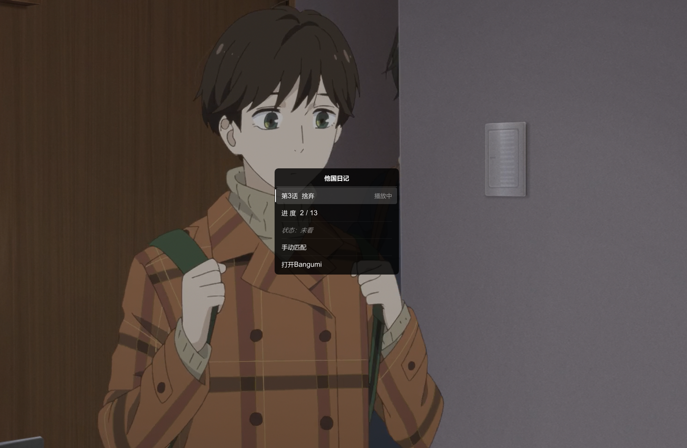

# mpv_bangumi_sync

使用 mpv 播放动画时，自动同步 Bangumi 追番进度，并支持显示番剧信息。

## 功能
- 自动识别番剧并匹配Bangumi条目
- 播放视频后，如果这个番剧在Bangumi没有收藏，自动标为在看，并在左上角弹出提示
- 观看进度达到配置阈值（默认0.9）时自动将Bangumi这一集标为看过，并在左上角弹出提示
- 默认绑定"Alt+o"打开番剧信息表，界面如下



## 依赖
- **curl**（HTTP 请求）
- **ffprobe**（视频信息提取）
（一般电脑都装了，不用管）

## 安装
把仓库克隆或下载 zip 解压到mpv的插件目录，mpv-lazy如下：
```
mpv-lazy/portable_config/scripts/mpv_bangumi_sync
```

## 配置
在 mpv 配置目录创建 `script-opts/mpv_bangumi_sync.conf`：
```
portable_config/script-opts/mpv_bangumi_sync.conf
```

示例配置：
```conf
# Bangumi 访问令牌（必需）
# 获取地址：https://next.bgm.tv/demo/access-token
bgm_access_token=你的访问令牌

# 番剧存储目录（多个目录用分号/冒号分隔）
storages=D:/Anime;E:/Anime

# 观看进度达到该比例时标记为“已看”（0~1）
progress_mark_threshold=0.9

```

如果要添加uosc按钮，可以在uosc.conf中的"controls="字段添加
`command:info:script-message open-bangumi-info?番剧信息`
放在喜欢的位置即可

## 使用
- 播放视频后会自动匹配并在进度达到配置阈值（默认0.9）时标记为“已看”
- `Alt+o` 打开当前番剧的信息窗口


## 数据目录
- `portable_config/mpv_bangumi_sync_data/`

## 注意
- 插件只在 `storages` 指定的目录下生效

## 后续开发计划
本项目只专注与bgm相关的功能，后续也不会添加比较重型的功能


✅ 适配 uosc，添加同步信息窗口

✅ 优化缓存匹配更新逻辑，目前部分场景会存在匹配不到信息又不更新缓存的bug，近期会修复（一月番好看的太多了，没时间debug）

⬜️ 适配补番逻辑，避免短时间每集都标记一次导致刷屏 Bangumi 时间线

⬜️ 从api获取信息的流程改为异步，这样不阻塞打开信息窗口。（mpv lua似乎没有线程的概念，方案还需再想想，改动会比较大）


## 感谢
本项目大量借用 [mpv_bangumi](https://github.com/slqy123/mpv_bangumi)的代码，在此基础上删除了弹幕功能，移除了对 Python 和闭源可执行程序的依赖，纯lua实现。


番剧信息窗口依赖于[uosc UI框架](https://github.com/tomasklaen/uosc)。要使用该功能请为mpv播放器安装uosc。uosc的安装步骤可以参考其[官方安装教程](https://github.com/tomasklaen/uosc?tab=readme-ov-file#install)。如果使用[MPV_lazy](https://github.com/hooke007/MPV_lazy)等内置了uosc的懒人包则只需安装本插件即可。

PS：⚠️⚠️之前没用过lua，所以大部分代码是AI写，我负责review和debug，使用上有bug可以提issue，有时间就会尽力解决
