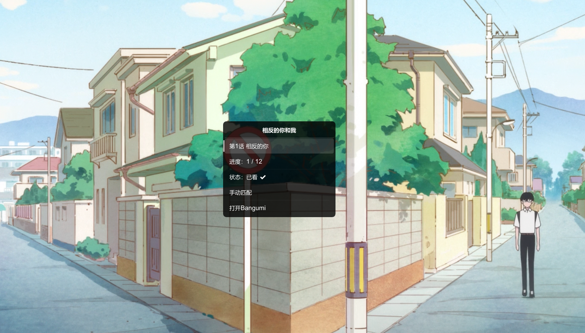

# mpv_bangumi_sync

使用 mpv 播放动画时，自动同步 Bangumi 追番进度，并支持显示番剧信息。

插件会在播放文件后自动识别番剧和集数，读取当前 Bangumi 剧集状态，并在播放进度达到阈值后将当前集标记为“已看”。如果条目尚未收藏或不是“在看”，会在同步单集状态时一并更新条目状态。

## 目录

- [功能](#功能)
- [依赖](#依赖)
- [安装](#安装)
- [配置](#配置)
  - [常用选项](#常用选项)
- [使用](#使用)
  - [网络视频播放](#网络视频播放)
  - [手动匹配](#手动匹配)
- [数据目录](#数据目录)
- [注意](#注意)
- [后续计划](#后续计划)
- [感谢](#感谢)

## 功能

- 自动识别番剧并匹配 Bangumi 条目
- 播放进度达到阈值后自动标记当前集为“已看”
- 支持批量标记，减少连续观看多集时的 Bangumi 时间线刷屏
- 支持自动点格子开关，禁用后仅展示信息，不自动标记 Bangumi 格子
- 支持番剧信息窗口，查看当前条目、剧集进度和单集状态
- 支持手动匹配弹弹play结果，或直接搜索 Bangumi 条目绑定当前目录
- 支持网络视频播放，根据 URL 自动选择完整文件匹配或流媒体标题匹配

番剧信息窗口：




## 依赖

- curl：用于 HTTP 请求
- ffprobe：用于读取视频信息
- uosc：用于显示番剧信息窗口

MPV_lazy 通常已经包含这些组件。没有 uosc 时，自动同步功能仍可使用，但番剧信息窗口不可用或体验受限。

## 安装

下载 zip 并解压到 mpv 的脚本目录。下面路径均相对于 `mpv.exe` 或 `mpvnet.exe` 所在目录；如果 `portable_config`、`scripts` 或 `script-opts` 目录不存在，手动新建即可。

```text
~/mpv/portable_config/scripts/mpv_bangumi_sync
```

目录中应包含 `main.lua`、`src`、`mpv_bangumi_sync.conf` 等文件。

<details>
<summary>文件结构</summary>

```text
mpv
├── mpv.exe
└── portable_config
    ├── scripts
    │   └── mpv_bangumi_sync
    │       ├── LICENSE
    │       ├── README.md
    │       ├── main.lua
    │       ├── mpv_bangumi_sync.conf
    │       └── src
    └── script-opts
        └── mpv_bangumi_sync.conf
```

</details>

## 配置

将插件目录中的 `mpv_bangumi_sync.conf` 复制到 mpv 配置目录的 `script-opts` 下：

```text
portable_config/script-opts/mpv_bangumi_sync.conf
```

至少需要配置 Bangumi access token 和动画存储目录：

```conf
bgm_access_token=your_access_token
storage1=D:/Anime
```

Bangumi access token 可在这里生成：

https://next.bgm.tv/demo/access-token

如果有多个动画目录，Windows 使用分号分隔，Linux/Mac 使用冒号分隔：

```conf
storage1=D:/Anime;E:/Anime
storage1=/home/user/Anime:/mnt/nas/Anime
```

插件只会处理 `storage1` 和 `storage2` 指定目录下的视频。
设置两个目录是为了分别设置点格子的频率，比如新番希望看一集立马点一次格子，补旧番希望4集点一次格子避免刷屏。如果没有这种需求的话，统一设置在storage1下就行

### 常用选项

```conf
enable_auto_mark=yes
progress_mark_threshold=0.9
storage1_batch_sync_threshold=1
storage2_batch_sync_threshold=4
bangumi_api=https://api.bgm.tv
bgm_proxy=
bgm_proxy_skip_cert_verify=no
network_file_hosts=
```

- `enable_auto_mark`：是否自动点 Bangumi 格子。设为 `no` 时只展示信息。
- `progress_mark_threshold`：标记已看的播放进度阈值，`0.9` 表示 90%。
- `storage*_batch_sync_threshold`：待同步剧集数量达到阈值时批量同步。设为 `0` 时不按数量自动同步，但退出 mpv 或关闭自动点格子时仍会同步。
- `bangumi_api`：Bangumi API URL，可设置为镜像或兼容 API 地址。必须使用完整 URL，例如 `https://api.bgm.tv`。**请自行确认 API URL 的安全性；因使用第三方 API URL 产生的问题，本插件不负责**
- `bgm_proxy`：Bangumi API 代理，留空表示不使用代理。该代理不影响弹弹play API。
- `bgm_proxy_skip_cert_verify`：配置 Bangumi API 代理后是否跳过 TLS 证书验证，默认 `no`，仅在 `bgm_proxy` 非空时生效。只应在使用可信代理但频繁报TLS证书校验失败时开启；**开启后可能导致中间人攻击风险，请勿在不可信网络或不可信代理中使用**。
- `network_file_hosts`：网络 URL 完整文件域名/IP 列表，使用英文逗号分隔。命中的 host 会按完整视频文件处理。

代理示例：

```conf
bgm_proxy=http://127.0.0.1:7890
bgm_proxy=socks5h://127.0.0.1:7890
# 使用可信代理但证书链不可验证时：
# 注意：跳过证书验证可能导致中间人攻击风险。
bgm_proxy_skip_cert_verify=yes
```

## 使用

播放 `storage1` 或 `storage2` 下的视频后，插件会自动初始化当前番剧信息。播放进度达到阈值时，会将当前集加入同步队列；队列达到对应 storage 的批量同步阈值后写回 Bangumi。

默认快捷键：

```text
Alt+o
```

打开番剧信息窗口后，可以查看标题、剧集进度、单集状态，刷新 Bangumi 剧集信息，切换自动点格子，或进入手动匹配。

如果要在 uosc 控制栏添加按钮，可在 `script-opts/uosc.conf` 的 `controls=` 中添加：

```text
command:info:script-message open-bangumi-info?番剧信息
```

### 网络视频播放

播放网络 URL 时，插件会自动初始化番剧匹配流程，并按 URL 类型选择匹配模式。

- 完整文件：适用于 WebDAV、直链视频等场景。插件会通过视频文件后缀或 `network_file_hosts` 判断，读取网络文件前 16MB 计算 hash，再使用弹弹play匹配番剧和剧集。
- 流媒体：适用于普通在线播放源。插件会从 mpv metadata、播放列表标题、media-title、URL 等信息中推断标题，并使用 Bangumi 搜索和手动绑定流程。

如果自动判断不准确，可以在番剧信息窗口中切换“匹配模式”。本地文件播放不会显示该选项。

对于没有明显视频文件后缀、但实际是完整视频文件的网络地址，可以在配置中加入 host 白名单：

```conf
network_file_hosts=example.com,192.168.1.10
```

### 手动匹配

自动匹配失败或结果不准确时，可以从番剧信息窗口进入手动匹配。

- 弹弹play 搜索：按弹弹play番剧和剧集重新选择
- Bangumi 搜索：直接选择 Bangumi 条目，并绑定当前目录

通过 Bangumi 搜索绑定目录后，同一目录下的后续剧集会优先使用该 Bangumi 条目。

## 数据目录

插件会在 mpv 配置目录下缓存数据，以减少API使用频率：

```text
portable_config/script-data/mpv_bangumi_sync/
```

该目录用于保存弹弹play id、Bangumi 条目、剧集信息和手动绑定结果。通常不需要手动修改。

## 注意

- 本插件主要在 Windows 10 环境测试，其他系统未充分验证。
- 本地文件只在 `storage1` 和 `storage2` 指定目录下生效；网络视频不受本地存储目录限制。
- 若当前集打开时已是“已看”，不会再启动进度检测定时器。
- 关闭 mpv 时会同步尚未 flush 的 pending 记录；pending 较多时可能影响退出速度。如果比较介意的话，请将storage*_batch_sync_threshold修改到1
- 如果同一路径同时匹配两个 storage 组，会使用匹配路径更长、更具体的那一组配置。

## 后续计划

本项目只专注于 Bangumi 相关功能，后续也不会添加较重型功能。

- ✅ 适配 uosc，添加同步信息窗口
- ✅ 优化缓存匹配更新逻辑
- ✅ 适配批量同步逻辑，避免短时间每集都标记一次导致刷屏 Bangumi 时间线
- ⬜ 从 API 获取信息的流程改为异步，减少打开信息窗口时的阻塞

## 感谢

本项目大量借用 [mpv_bangumi](https://github.com/slqy123/mpv_bangumi) 的代码，在此基础上删除了弹幕功能，移除了对 Python 和闭源可执行程序的依赖，纯 Lua 实现。

番剧信息窗口依赖 [uosc UI 框架](https://github.com/tomasklaen/uosc)。如果使用 [MPV_lazy](https://github.com/hooke007/MPV_lazy) 等内置 uosc 的懒人包，只需安装本插件即可。

感谢[弹弹play](https://www.dandanplay.com/)提供的番剧匹配API

## 其他
如果需要使用弹幕功能，推荐安装[uosc_danmaku](https://github.com/Tony15246/uosc_danmaku)
